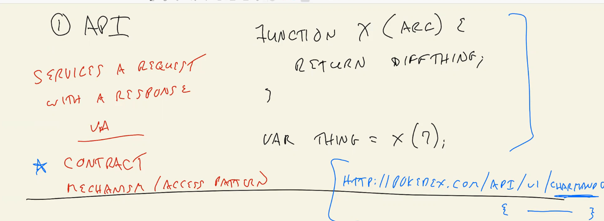
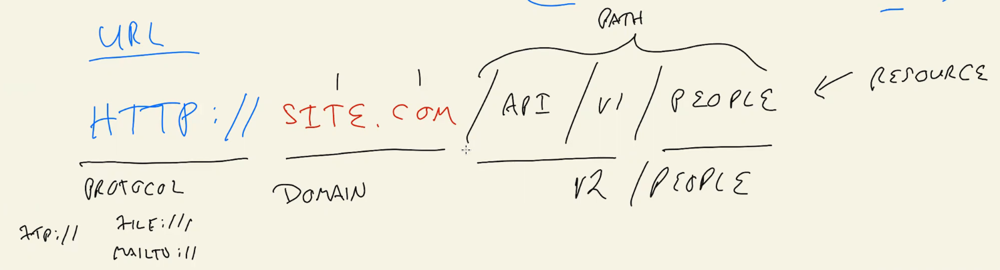
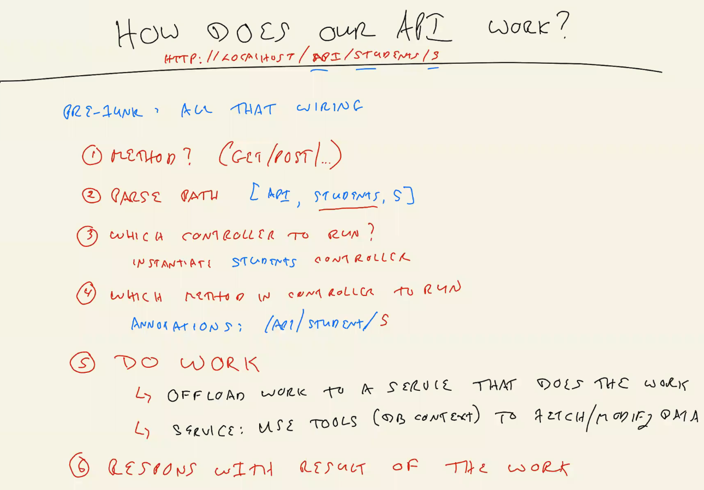
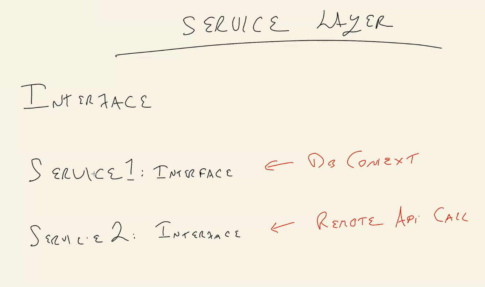
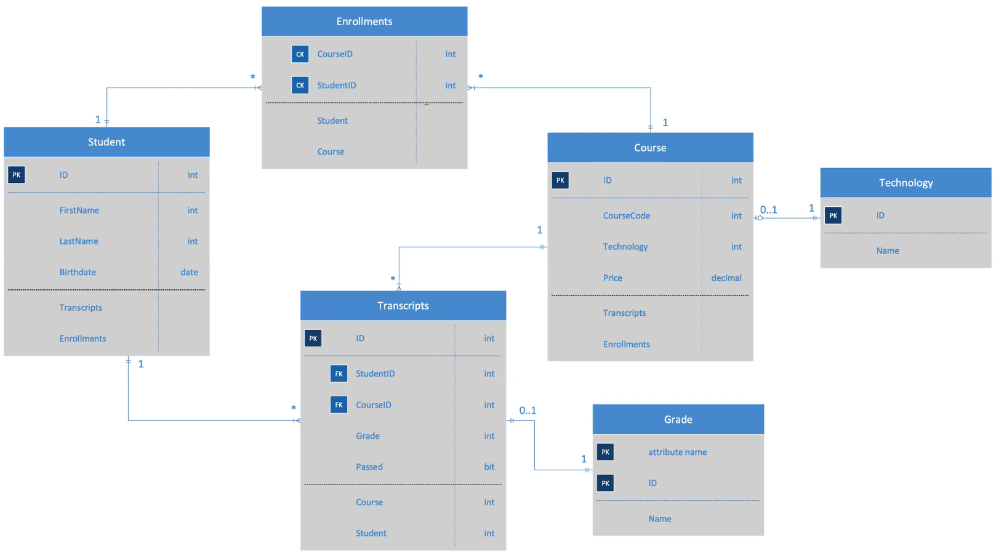
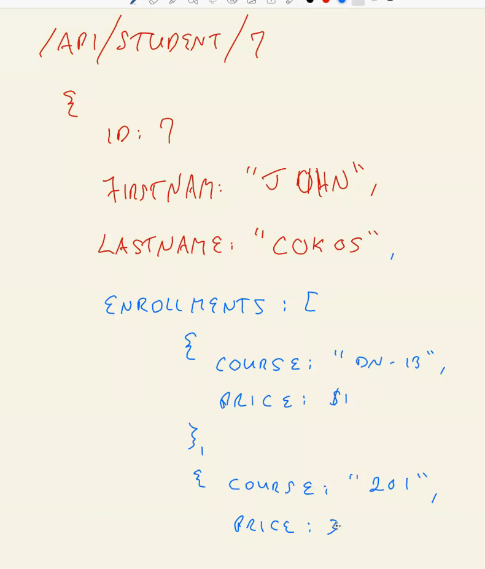
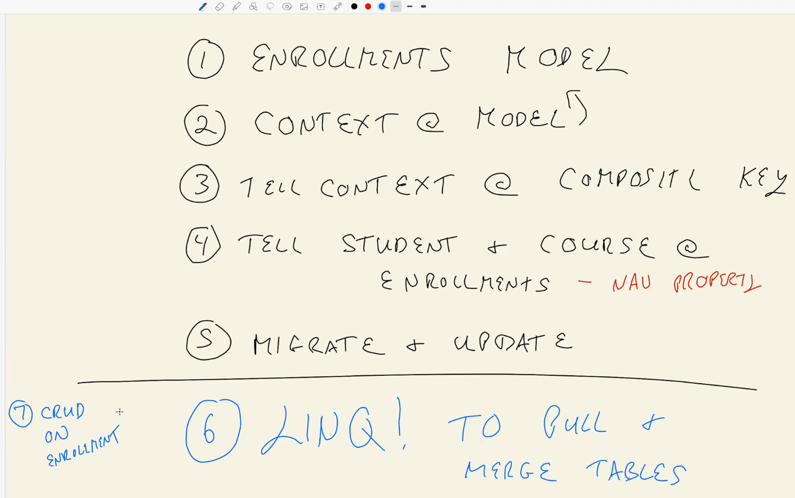
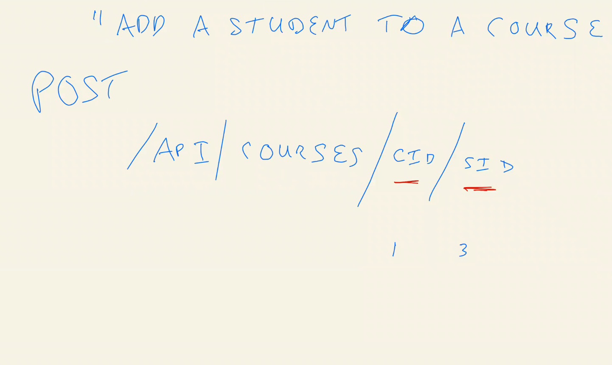

# dn-class-14-demo

## what we are bulding?

- **API**
  
  
  - function is an API because they both get back some data.  

  - API service a requset with a requset.

  - ```https://swapi.dev/api/people```

  - the function and the starWar API is effectively the same.

  - calling the function in the app with some arrangements and getting back some data is the same of calling a function in the server with an arrangements like (people) and getting back some data there is no difference.
  - so this is the API.

## what the parts of URL?

  

- in image

- **Domain** : where the code lives

- compare with the api in the controller

  - ```api/students & api/student/5```

  - we can custome a route ```api/student/5/tech/1/2```

## How Dose the API Work?



## Service Layer



----------------------
-----------------------

## BREAK

---------------------------------------
---------------------------

## ERD



### what is the difference betweeen the ERD STD and the STD model in VS?

- **the relations**

### what is special at the enrolment table?

- what is missing.

  1. No content
  2. NO PK

### Draw the Json Respone



- tell them the name (navigation properties)

- so we will create an identfires called (navigation properties) that bulit in he framework that gona till .NET that **Student** table connected withe the **enrollments** also **Student** table connected withe the **Transcripts** table

- so today what we are going to do is to put this line in place and connecte table togather.

## Lab Steps



1. add the course model
2. add the cource servise
3. add the Interface
4. add the controller

5. Seed the DB

- ***DO NOT MIGRATE LET THE ERROR happen***
- MIGRATE
- RUN the program

- check the routes

- till them about the one to one  relation on TECH and Course and that why we dont need join table but we needed in enrollments

## Enrollmente Table

 1. add the Model
 2. add the Navigation properties  
 3. student Nav
 4. Course Nav
 5. in student table add a list of enrollments
 6. in Course table add a list of enrollments (explain to them that now they are connected)
 7. add the DBSet for enrollments  ***DO NOT MIGRATE LET THE ERROR happen***
 8. add the modelBuilder for compasit key
 9. MIGRATE
 10. show them the migration file
 11. open the SQL explorer and open the enrollments
 12. add data to enrollments
 13. ask what step 12 do
 14. run the server and check the students/1 (enrollment added why)

 15. point that we cover the steps for *LabSteps*

## LINQ

- connecte the Linq lab to today lab

----------------------
-----------------------

## BREAK

---------------------------------------
---------------------------

- open the student/1

- till them we want to change the null in the student/1 to array of object

- ask where we want to do the logic for the previous step

- explain the answer: the path is student which offload work to the servise

- in student service:

  - in GetStudent  

  1. start writing the Linq in **first way**

  2. run the server and ask what happend

  3. explain the cycle and the solutin

  4. install the dependency and added to the startup

  5. start the server to students/1
  
  6. start writing the Linq in **second way**

  7. the same result

  - in GetStudents  
  
    1. start writing the Linq in **second way**

    2. start the server to course

- in Course service:

  - in GetCourse

  1. start writing the Linq in **second way**

  2. start the server to course/1
  
  3. the same result

  - start the server to /course stil null

    - in GetCourses

      1. start writing the Linq in **second way**

      2. start the server to course

## Custom Route



- ask where to add the add student to course

- in Course controller start writing the add student to course action

- in Course service start writing the add student to course action

- show them the erro in the controller then added to the interface

- run the server and postman

- use the custome route

- prove it work
