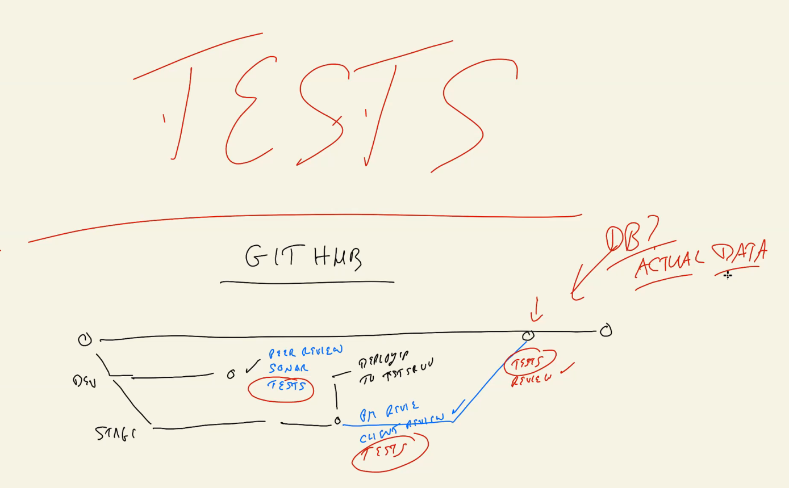

# dn-class-15-demo

## Tests

- we are not going to test the API we are going to test the servises

- we will do the testing by Mocking (Mimic)

- what to Mock ==> DBContext

-----------------------

## GitHub pipeline deployment

-----------------------

- Why Mock?

- to not add a junk data to DB we will add the database in memory

- we will use SQLlite and will take all the sql commands (DB update)

-it will start server DB and enable us to add, delete to the DB then when the test is done we will destroy the DB

- EX: the delete student

-----------------------

## code

-----------------------

## GitHub Actions

-----------------------

## Swagger

- is a way to document our API **LIVE**

- install the dependency (swashbuckle.ASPNetCore)

- add to Startup ==>servises
- add app.use ==> run ==> app.useUI ==> run
